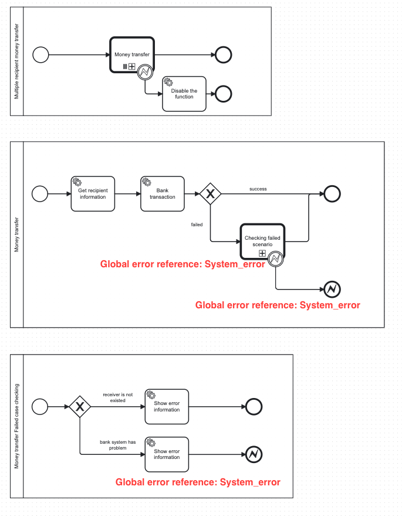
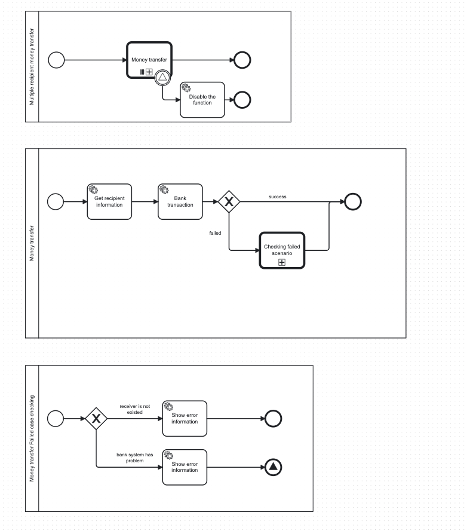

# Camunda 7: Optimistic Locking Exception - What is it and Solution

Camunda 7 is a powerful tool to supporting BPMN for workflow and process automation. Camunda is allow multiple processes are executed at the same time. This is one the reason why Optimistic locking exception occurs if you don't fully understand the concept

## Optimistic Locking Exception

Optimistic Locking (also Optimistic Concurrency Control) is a method for concurrency control, which is used in transaction based systems.

Optimistic Locking Exception happens when more than 1 process try to make changes in the same memory slot. It usually occurs when multiple processes run same service task or throw a same error event at the same time. In this article, I will present the solution for second case: **Multiple processes throw a same error event at the same time**

### Example

For example, we have these processes below to transfer money to multiple recipients at the same time in banking system.

- Multiple recipients money transfer: This process holds a list of recipients and execute **Money transfer process** for each recipient in parallel.

- Money transfer process: We need user to fill in all neccessary information such as: destination account id, the amount of money, message. After that, we set up a service task to do the transaction. If the bank transaction service task run successfully, the process is finish. Otherwise, if it encounter any exception, it will call **Money transfer Failed case checking process** to check if it is a technical system from banking system. If it is a system error, the process will throw a error event

- Money transfer Failed case checking: In this process, we need to categorize the bank transaction exception. If it is an user input error, the process will show the error information and end the process so that user can retry again. However, if it is a system error, the process will show the error information and throw an error event to parent process in order to temporary disable the function.

### Root cause

In this example, we use the same global error reference for both process. When multiple of **Money transfer process** is evoked at the same time and have the same technical issue, it throws the same global error reference which hold the same memory slot.

Timeline example: 2 instances with Instance 1 runs faster than Instance 2

- Instance 1:
  T0: It throws error event (System_error) in **Money transfer Failed case checking process**
  T1: It catch System_error event then throw another System_error in **Money transfer process**

- Instance 2:
  T1: It throws error event (System_error) in **Money transfer Failed case checking process**

As you can see, at T1, both proccesses tried to access a same slot of memory for System_error event. Optimistic locking exception occurs.

### Solution

The solution for this issue is we use signal in place of error event. Instead of throwing multiple errors and catch it, we can send a signal in the child process and try to catch it in parent process. Since signal is global accross processes in Camunda, we can catch signal anywhere, even in different bpmn file.

