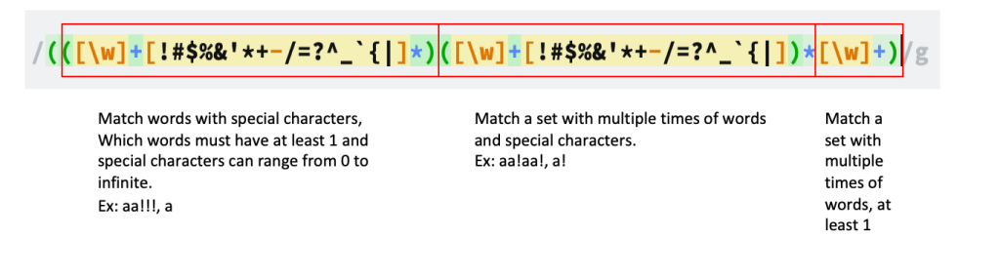

# Learn regular expression with some common usages (Part 1: Email validation)

We all know Regular expression (RegEx) as a powerful tool for input validation and other string operations. In this post, I will share some popular patterns of Regex that are widely use by developers.

## Email validation

### Analyze the requirement

Each email address can be divided into four parts:
[recipient-name]@[domain-name][top-level-domain]

**Recipient name can have 1 to 64 characters in length and consist of:**

- Uppercase and lowercase letters in English (A-Z, a-z)
- Digits from 0 to 9
- Special characters such as ! # $ % & ‘ \* + – / = ? ^ \_ ` { |

**Domain name and Top-level domain may be a maximum of 253 characters:**

- Uppercase and lowercase letters in English (A-Z, a-z)
- Digits from 0 to 9
- A hyphen (-)
- A period (.) (used to identify a sub-domain; for example, email.domainsample)

### Patern

**Domain name**<br>
First, let start with domain name – the easiest part: ([\w]+) because it can contains words only and must have at least 1 words.

**Top-level domain name**<br>
Second, with top-level domain name, it has the same rule with domain name

**Recipient name**<br>
Third, with recipient name, we have some strict rules: it can not start or end with special characters and any special characters can not be appear consecutively two or more times. We analyze the problem, it have two scenarios:

- It contains special characters

```javascript
(([\w]+[!#$%&’*+-/=?^_`{|]_)([\w]+[!#$%&’_+-/=?^\_`{|])\*[\w]+)
```



- It not contains special character: (\w)+

```javascript
(\w)+
```

### Result

Combine different parts and we have the result:

```javascript
((([\w]+[!#$%&’*+-/=?^_`{|]*)([\w]+[!#$%&’*+-/=?^_`{|])*[\w]+)| ([\w]+))@([\w]+).([\w]+)
```
