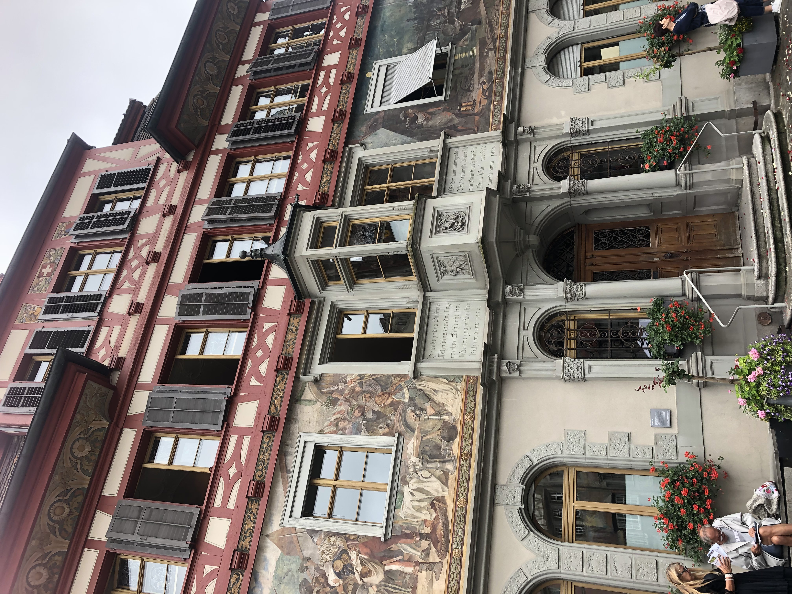
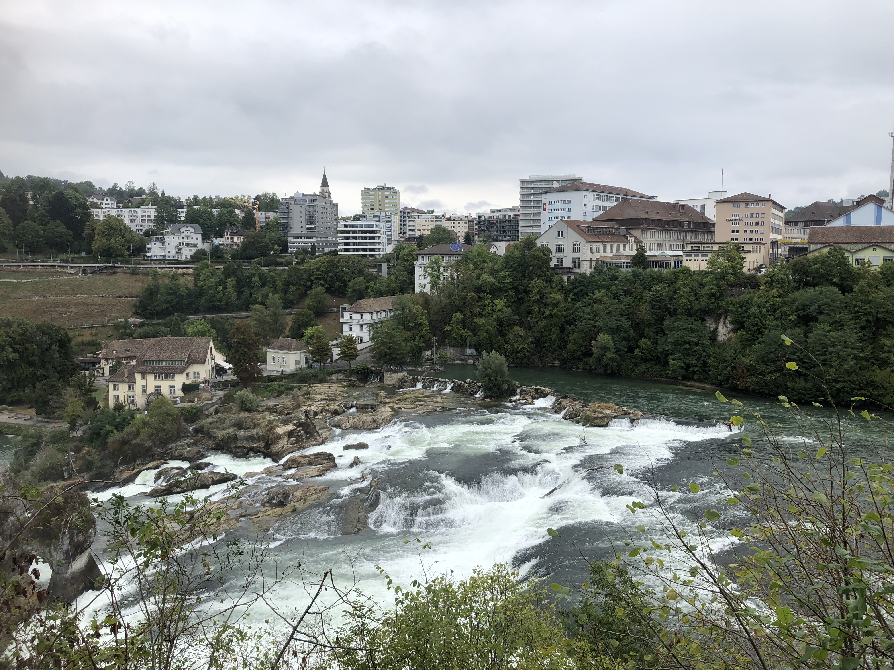

# Kinh nghiệm du lịch Zurich - Luzern Thuỵ sĩ

Hi mọi người, tháng 9 năm 2022 mình đã rất may mắn khi có cơ hội đi làm onsite tại Thuỵ sĩ. Trong khoảng thời gian
2 tuần mình ở tại đây, mình đã có cơ hội ghé thăm 1 số địa điểm du lịch hết sức xinh đẹp ở Zurich và Luzern. Sau đây
sẽ mình sẽ chia sẻ một số tips cho các bạn có ý định du lịch tự túc tại đất nước vô cùng xinh đẹp cũng như vô cùng đắt
đỏ này nhé.

## Di chuyển

Phương tiện giao thông rất phát triển. Hệ thống tàu điện và xe lửa của Thuỵ sĩ rất sạch, nhanh và luôn luôn đúng giờ.
Để book vé tàu ở Thuỵ sĩ thì bạn có 2 cách: 1 là ra tận ga tàu và book trên kiosk điện tử (nếu sử dụng cách này thì
bạn phải có thanh toán Apple pay hoặc thẻ ATM nội địa), 2 là bạn có thể book trực tiếp trên điện thoại qua ứng dụng SBB Mobile.

App sử dụng cũng khá dễ, các bạn chỉ cần nhập ga tàu hiện tại và ga tàu điểm đến. Sau đó nhấn chọn mua vé, màn hình tiếp theo
sẽ có 2 option vé xe lửa cho mọi người chọn:

- Point-to-point ticket: Đây là vé chỉ bao gồm chuyến xe di chuyển giữa điểm đi và điểm đến. Không bao gồm giá các chuyến xe
  đi thăm xung quanh các địa điểm du lịch ở điểm đến
- City offer: Đây là vé bao gồm chuyến xe di chuyển giữa điểm đi và điểm đến và bao gồm giá các chuyến xe
  đi thăm xung quanh các địa điểm du lịch ở điểm đến hoặc điểm đi tuỳ theo mình chọn. Ví dụ: Tôi chọn mua vé từ Zurich Bahnhof tới Luzern Bahnhof, chọn 2 chiều, chọn option City offer và chọn City ticket ở Luzern. Điều này có nghĩa là tôi có thể đi 2 chiều từ Zurich tới Luzern đồng thời tôi cũng có quyền đi các chuyến trams (tàu điện trong thành phố), xe bus, tàu lửa, thuyền trong khu vực Luzern trong vòng 1 ngày (Mình rất khuyến nghị các bạn nên mua vé này vì nó sẽ rất tiện cho các bạn đi du lịch giữa các điểm du lịch vì đi bộ sẽ rất là mỏi chân)

Nếu như các bạn đi du lịch liên tục, mỗi ngày 1 địa điểm ở xa nhau thì mình khuyến khích các bạn nên mua cái Swiss Travel Pass này nha, nó sẽ tính trọn gói di chuyển cho các bạn miễn là các bạn ở trong nước Thuỵ sĩ. Các bạn được sử dụng miễn phí tất cả phương tiện giao thông đường thuỷ và đường bộ. Các bạn hãy tham khảo để mua gói này ở đây nhé: [Swiss Travel Pass](https://www.kkday.com/en/product/2524-swiss-travel-pass?cid=2636&ud1=English_VN&ud2=sw_2524&gclid=Cj0KCQjw1rqkBhCTARIsAAHz7K12Eqj_AQK_y4RAEzUXhwLoKoSSg3TnUxKIfM_ErMB8YnATxg6S_EAaAlq9EALw_wcB)

## Ẩm thực

Thuỵ sĩ không nổi tiếng về ẩm thực. Thức ăn bản địa Thuỵ sĩ bản chất không khó ăn, nhưng ăn dễ bị ngấy vì khá nhiều phô mai và ít rau xanh. Nhưng nếu như bạn vẫn muốn thử xem ẩm thực của Thuỵ sĩ ra sao thì bạn nên thử đến nhà hàng này ở Zurich.
Quán tên là Zeughauskeller, quán khá đông nên bạn nhớ đặt chỗ trước còn không phải chờ đợi trước khi được xếp bàn. Món đặc biệt của quán là Zürcher Geschnetzeltes, bánh khoai tây ăn kèm cùng thịt bê sốt kem nấm. Một phần ăn khá là to nên nếu bạn là nữ thì nên cân nhắc nhé. Hình thức của món này sẽ giống thế này đây:

Ngoài ra, nếu như thương nhớ hương vị Việt Nam tại Thuỵ sĩ, bạn nên ghé thử Sapa canteen tại Zurich. Quán được đánh giá khá cao và cũng khá đa dạng đồ ăn Việt

Nếu như bạn có ghé thăm tới điểm du lịch là thác Rheinfall thì bạn nên ghé tới thị trấn nhỏ Stein am Rhein gần đó với những ngôi nhà cổ hơn 1000 tuổi và thưởng thức món cá nướng được đánh bắt từ chính sông Rhein chảy qua thị trấn. Đây sẽ là một trải nghiệm ẩm thực tuyệt vời.

Ngoài ra, khi đến Thuỵ sĩ, bạn sẽ luôn gặp những cửa hàng tiện lợi, những siêu thị mini của hai hãng lớn là Migros và COOP. Bạn hãy thử món Pain au chocolate mà người Thuỵ sĩ luôn tự hào ở trong cửa hàng bánh ở Migros nha. Để tiết kiệm chi phí thì khi mình đi công tác, trừ bữa tối ăn nhà hàng thì bữa sáng và bữa trưa mình đều mua đồ ăn ở Migros. Buổi sáng thì mình thường chọn những món ăn nhẹ như bánh ngọt, nước cam. Bữa trưa thì mình có thể ăn salad hoặc các món chiên. Đặc biệt, Thuỵ sĩ có một loại thức uống khá đặc biệt mà mình rất ghiền trong khoảng thời gian on-site. Nó chính là Rivella, một loại thức uống chiết xuất từ sữa nhưng không hề giống sữa, chua chua ngọt ngọt và có gas. Mình được nghe đồng nghiệp kể lại rằng vì trẻ em tại Thuỵ sĩ lười uống sữa nên họ đã tạo ra thức uống này để trẻ em uống sữa nhiều hơn.

## Du lịch và thăm quan

Thuỵ sĩ là một đất nước xinh đẹp và có vô vàn điểm tham quan cho các bạn khám phá. Mình cũng chưa được đi nhiều nơi ở Thuỵ sĩ, chỉ lòng vòng khu vực Zurich và Luzern thôi. Đây là một số điểm tham quan mình đã được ghé qua và mình sẽ xếp hạng theo vẻ đẹp thiên nhiên và trải nghiệm của mình nha.

- Du thuyền trên hồ Luzern đến Pilatus
- Núi Pilatus
- Thác Rhein
- Rhein am stein
- Phố cổ Zurich
Sau đây là một số hình ảnh về chuyến du lịch của mình, mời các bạn chiêm ngưỡng vẻ đẹp thiên nhiên hùng vĩ và đầy thơ mộng của đất nước Thuỵ Sĩ:
<figure markdown>
  { width="500" align=center }
  <figcaption>Phong cảnh khi đi du thuyền trên hồ Luzern</figcaption>
</figure>
<figure markdown>
  { width="300" align=center }
  <figcaption>Đỉnh Pilatus bao quanh bởi mây mù</figcaption>
</figure>
<figure markdown>
  { width="300" align=center }
  <figcaption>Thị trấn Stein am Rhein kế dòng sông Rhein</figcaption>
</figure>
<figure markdown>
  { width="500" align=center }
  <figcaption>Thác Rhein hùng vĩ, biên giới tự nhiên giữa Đức và Thuỵ sĩ</figcaption>
</figure>
<figure markdown>
  { width="500" align=center }
  <figcaption>Phố cổ Zurich</figcaption>
</figure>
